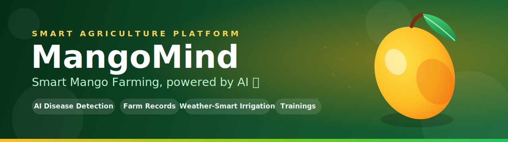
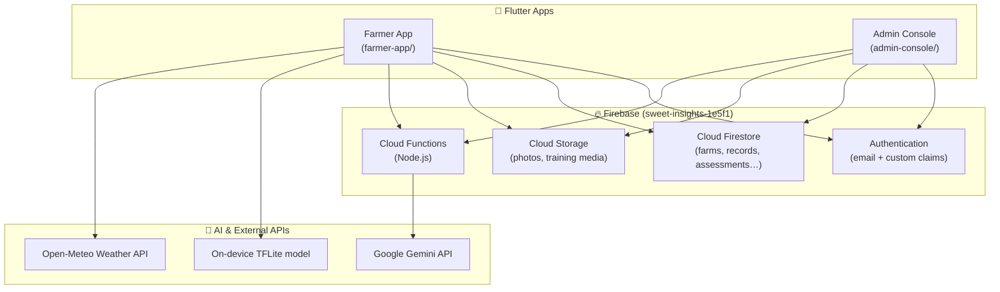

<div align="center">



<br/><br/>

A two-app platform that helps mango farmers detect plant diseases, track their
farms, and make weather-smart irrigation decisions — with a companion admin
console for management, training, and oversight.

<br/>


<br/>

[Features](#-features) • [Screenshots](#-screenshots) • [Architecture](#-architecture) • [Tech Stack](#-tech-stack) • [Getting Started](#-getting-started) • [Roadmap](#-roadmap)

</div>

---

## 🌱 About

**Sweet Insights** is a mobile platform built to support small-scale mango
farmers. It pairs **on-device AI** and **cloud AI** to identify common mango
diseases from a photo, then layers in practical farm-management tools —
yield tracking, irrigation logs, weather-based recommendations, training
materials, and self-assessments.

The project ships as a **monorepo** with two Flutter apps that share one
Firebase backend:

| App | Audience | Purpose |
| --- | --- | --- |
| 📱 **Client** | Farmers | Disease detection, farm records, weather & irrigation advice, trainings, assessments |
| 🛠️ **Admin** | Administrators | Manage farmer accounts & farms, publish trainings, review assessments, view dashboards |

---

## ✨ Features

### 📱 Farmer App (`farmer-app/`)

- 🔬 **AI Mango Disease Detection** — snap a leaf/fruit photo and get an instant
  diagnosis. Primary analysis runs in the cloud via **Google Gemini** (rich
  report: disease, ripeness, recommendations). If the cloud is unreachable, an
  **on-device TensorFlow Lite** model provides an offline fallback diagnosis,
  and the app clearly flags the result as a limited on-device estimate.
  - Detects: `Anthracnose` · `Powdery Mildew` · `Healthy Mango` · `Not a Mango`
- 🌾 **Farm Management** — create and manage multiple farms, with area, planting
  details, and disease/pest flags.
- 📒 **Farm Records** — log **yields**, **irrigations**, and **field observations**,
  with searchable, filterable history.
- 📊 **Yield Analytics** — visualize harvests over time with interactive charts.
- 🌦️ **Weather-Smart Irrigation** — live weather via Open-Meteo + geolocation,
  turned into actionable irrigation recommendations.
- 📝 **Self-Assessments** — guided questionnaires with draft, review, and
  submission flows, exportable as PDF reports.
- 🎓 **Trainings** — browse and enroll in training programs and materials.
- 💰 **Mango Price Tracker** — keep an eye on current market prices.
- 🔔 **Smart Notifications** — local reminders for irrigation and tasks.
- 🌙 **Dark Mode** & polished, animated UI.

### 🛠️ Admin Console (`admin-console/`)

- 👥 **User Management** — create, update, and remove farmer accounts.
- 🏤 **Farm Oversight** — manage farms and inspect their records and yields.
- 🎓 **Training Management** — publish trainings, upload materials, track enrollments.
- 🧾 **Assessment Review** — read and evaluate farmer submissions.
- 📈 **Dashboard & Records** — at-a-glance metrics across the platform.
- 🔐 **Role-Based Access** — admin actions are protected by Firebase custom claims.

---

## 📸 Screenshots

> _Add your screenshots to a `docs/screenshots/` folder and update the links below._

| Home & Weather | Disease Detection | Farm Records | Yield Analytics |
| :---: | :---: | :---: | :---: |
|  |  |  |  |

---

## 🏗️ Architecture



**How it fits together**

- Both apps authenticate against **Firebase Auth**; admin privileges are granted
  via a custom `admin: true` claim.
- App data lives in **Cloud Firestore**, guarded by ownership-based
  **security rules** (a farmer can only touch their own data; admins manage all).
- Image/disease analysis runs primarily via a **Cloud Function** that calls
  **Google Gemini** (the API key is stored in Secret Manager); when the cloud is
  unreachable the app falls back to the bundled **on-device TFLite** classifier.
- Weather and irrigation advice come from the **Open-Meteo API** + device location.

---

## 🧰 Tech Stack

<table>
<tr><td><b>Frontend</b></td><td>Flutter · Dart · Material 3 · Google Fonts · fl_chart · table_calendar · flutter_animate · shimmer</td></tr>
<tr><td><b>Backend</b></td><td>Firebase Authentication · Cloud Firestore · Cloud Storage · Cloud Functions (Node.js)</td></tr>
<tr><td><b>AI / ML</b></td><td>TensorFlow Lite (on-device) · Google Gemini (cloud)</td></tr>
<tr><td><b>APIs & Device</b></td><td>Open-Meteo · Geolocator / Geocoding · Camera · Local Notifications</td></tr>
<tr><td><b>Docs & Files</b></td><td>PDF generation · Printing · File pickers / savers</td></tr>
</table>

---

## 📂 Repository Structure

```
MangoFarming/
├── README.md
├── .gitignore                 # umbrella ignore rules
│
├── farmer-app/                # 📱 Farmer-facing Flutter app
│   ├── lib/
│   │   ├── pages/             # auth, home, farm, records, assessments…
│   │   └── ...
│   ├── assets/                # model.tflite, images, icons
│   └── functions/             # Cloud Function: imageAnalyzer (Gemini)
│
└── admin-console/             # 🛠️ Admin Flutter app
    ├── lib/
    ├── functions/             # user/farm management functions
    ├── firestore.rules        # Firestore security rules (source of truth)
    ├── firestore.indexes.json
    └── storage.rules          # Cloud Storage security rules
```

---

## 🚀 Getting Started

### Prerequisites

- [Flutter SDK](https://docs.flutter.dev/get-started/install) `>= 3.9`
- [Node.js](https://nodejs.org/) `>= 20` (for Cloud Functions)
- [Firebase CLI](https://firebase.google.com/docs/cli) — `npm i -g firebase-tools`
- An Android device or emulator

### 1. Clone

```bash
git clone https://github.com/bedrockexe/MangoFarming.git
cd MangoFarming
```

### 2. Run the farmer app

```bash
cd farmer-app
flutter pub get
flutter run
```

### 3. Run the admin app

```bash
cd ../admin-console
flutter pub get
flutter run
```

---

## 🔥 Firebase Setup

Both apps target the same Firebase project (`sweet-insights-1e5f1`). To use your
own project:

1. Create a Firebase project and add an **Android app** for each module.
2. Drop each `google-services.json` into the respective `android/app/` folder.
3. Regenerate Dart config with the FlutterFire CLI:
   ```bash
   flutterfire configure
   ```
4. Enable **Authentication** (Email/Password), **Firestore**, **Storage**, and
   **Cloud Functions** in the console.

### Cloud Functions

```bash
cd farmer-app/functions   # or admin-console/functions
npm install
firebase deploy --only functions
```

| Function | App | Purpose |
| --- | --- | --- |
| `imageAnalyzer` | farmer-app | Analyze a mango image with Google Gemini |
| `createUser` / `updateUser` / `deleteUser` | admin-console | Manage farmer accounts (admin-only) |
| `listUsers` | admin-console | List farmer accounts |
| `createFarm` / `updateFarm` / `deleteFarm` | admin-console | Manage farms (admin-only) |

### Deploy Security Rules

```bash
cd admin-console
firebase deploy --only firestore:rules,storage
```

---

## 🔐 Security & Secrets

This project follows secret-safe practices — **never commit credentials**:

- 🔑 **Gemini API key** is stored in **Secret Manager**, not in source:
  ```bash
  firebase functions:secrets:set GEMINI_API_KEY
  ```
- 🛡️ **Firestore & Storage rules** enforce ownership: farmers can only access
  their own data; admins are gated by the `admin: true` custom claim.
- 🚫 `serviceAccountKey.json`, `.env`, and operational scripts are **git-ignored**.

---

## 🗺️ Roadmap

- [ ] iOS support
- [ ] Offline-first sync for field use with poor connectivity
- [ ] Localization (Filipino / regional languages)
- [ ] Richer analytics & exportable farm reports
- [ ] Push notifications via FCM
- [ ] Expanded disease coverage in the detection model

---

## 🤝 Contributing

Contributions, issues, and feature requests are welcome!

1. Fork the repo
2. Create a branch (`git checkout -b feature/amazing-thing`)
3. Commit your changes
4. Open a Pull Request

---

## 📄 License

Distributed under the **Apache License 2.0**. See [`LICENSE`](farmer-app/LICENSE) for details.

---

## 👤 Author

**bedrockexe**
🔗 [github.com/bedrockexe](https://github.com/bedrockexe)

<div align="center">

⭐ If this project helped you, consider giving it a star!

<sub>Built with Flutter & Firebase · Made for mango farmers 🥭</sub>

</div>
